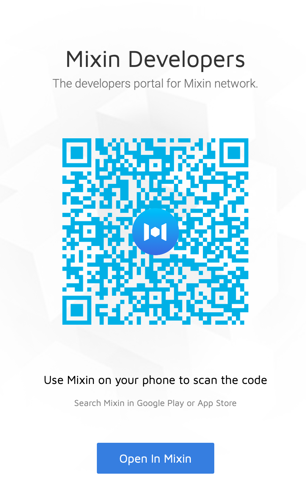
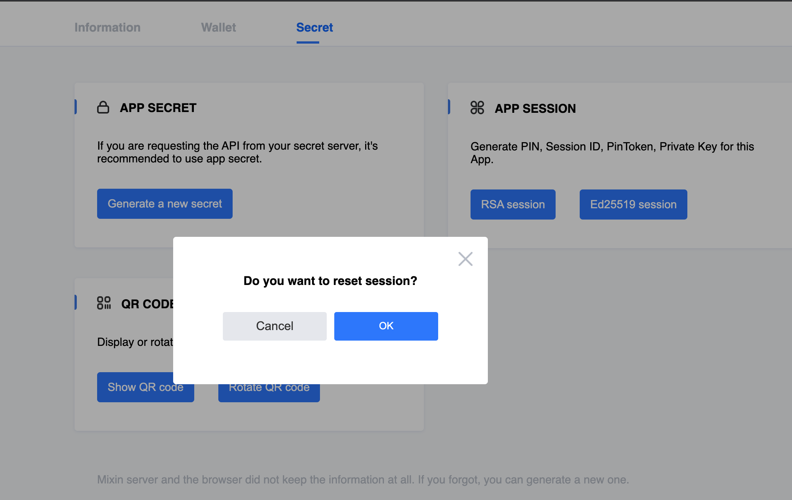
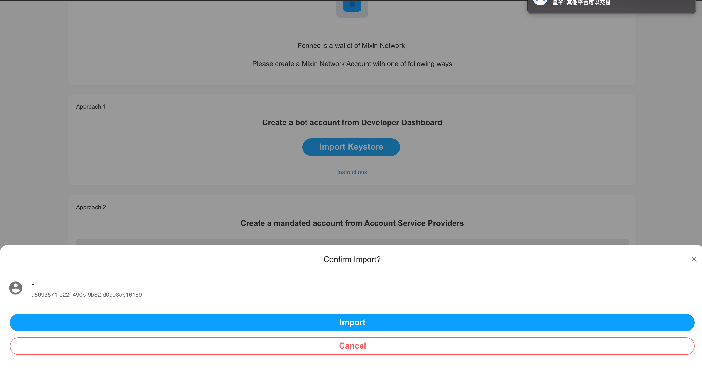
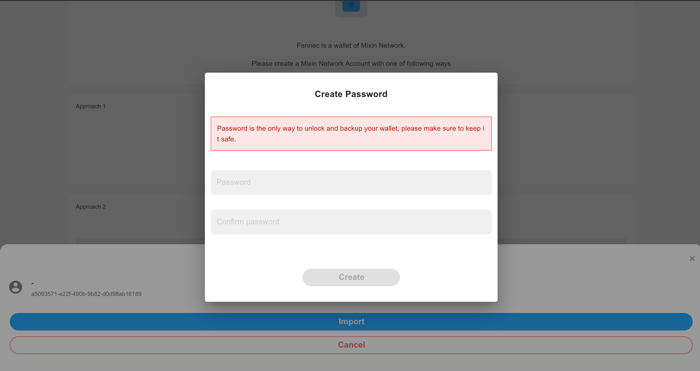
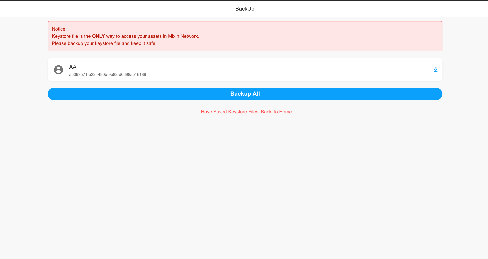
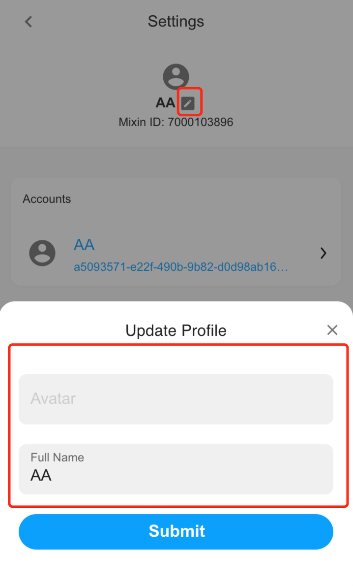

### Import from an existing keystore  

As Fennec is a wallet on Mixin Network, after creating a new bot account on Mixin Developer Dashboard, you will acquire a private address (keystore) that can be used to create an account in Fennec. The steps are as follows. 

1. Go to Mixin Developer Dashboard at  https://developers.mixin.one/dashboard

   If not authorized before, you will see the authorization page asking you to scan the QR code in Mixin Messenger. After authorizing, you will then see the developer dashboard.

   ​                                    

   

2. Click "+" to create a new app. 

   You will need to fill in the basic information of the bot account you intend to create. 

   Click "save", you will see the new app appear in the "My apps" catogary on the left side of the screen. 

   

3. Click the newly created app on the left column of the page then you will see three tabs. Choose the "Secret" tab. Follow the route "Secret  - APP SESSION - RSA session" to create a new keystore file and download it. 

   (*Please be noted that every time you click "RSA session", **if you confirm to reset session, you will generate a new keystore and your previous keystore will expire. ** That means if you've already created an account in Fennec using the previously generated keystore, you will no longer be able to login to the account. You will need to remove Fennec from your browser and re-add it, and then import your new keystore file. So please be very careful at resetting session in the developer dashboard!)

   ​                                                 

4. Return to Fennec, and click "Import Keystore". It will open your local files. Find the keystore file you've just downloaded and select it.  

      ​                                      

      

5. You will then be asked to create password for your wallet.

    ​                                           

    

6. After you've created the password, you will be able to use Fennec.

     ​                                     

You can edit the account name and avatar you just created in the account settings. 

