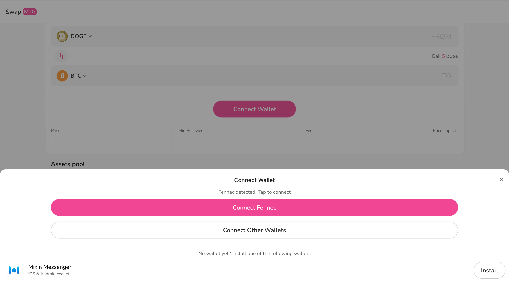
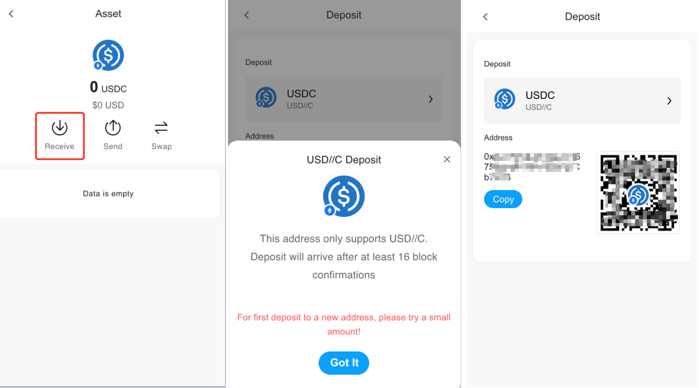

## Tutorial on Exchanging Assets on 4swap via Fennec 

Swapping between assets on Fennec is supported by 4swap (4swap.org), a decentralized exchange on Mixin Network that supports swapping cross-chain cryptocurrencies without gas fees. 

####  Scenario 1: If you have already created an account in Fennec

When clicking *Swap*, you will be directed to 4swap. On the *Swap* page, you will see the button *Connect Wallet*. The browser will very likely have detected Fennec already. Now, click **Connect Fennec** and then confirm the action, you will then be able to use your assets in Fennec on 4swap.  

Here is an example of swapping between assets on 4swap after you have successfully connected Fennec. Select the crypto asset you want to swap from and to, and fill in the amount you intend to swap, then click *Swap*. 

You will then need to place an order and verify your identity by entering your password. 

It usually takes seconds to confirm the order after you've paid successfully. But please also allow some more time if it doesn't show up in your asset list immediately. 

 Here is how it will look like in your Fennec account after a successfully swapping.

​                                                                                

##### If you need to deposit assets into Fennec before swapping 

You can go to the asset page in Fennec and click *Receive*. You will see the address for which you can use to deposit into Fennec. 

 

#### Scenario 2: If you haven't yet had an account on Fennec

Please first refer to https://github.com/fox-one/fennec/blob/main/README.md to create an account on Fennec, then follow the steps in Scenario 1. 

Hooray to successful swapping! 🎉

If you have more questions, you can contact us at:

Email: info@4swap.org

Discord: https://discord.com/invite/cdXXBxsK3M

Mixin 4swap Global Community at Mixin ID: 7000103925

